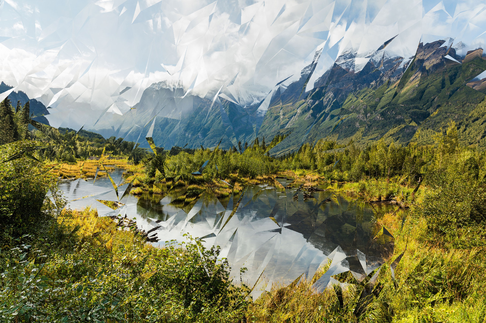
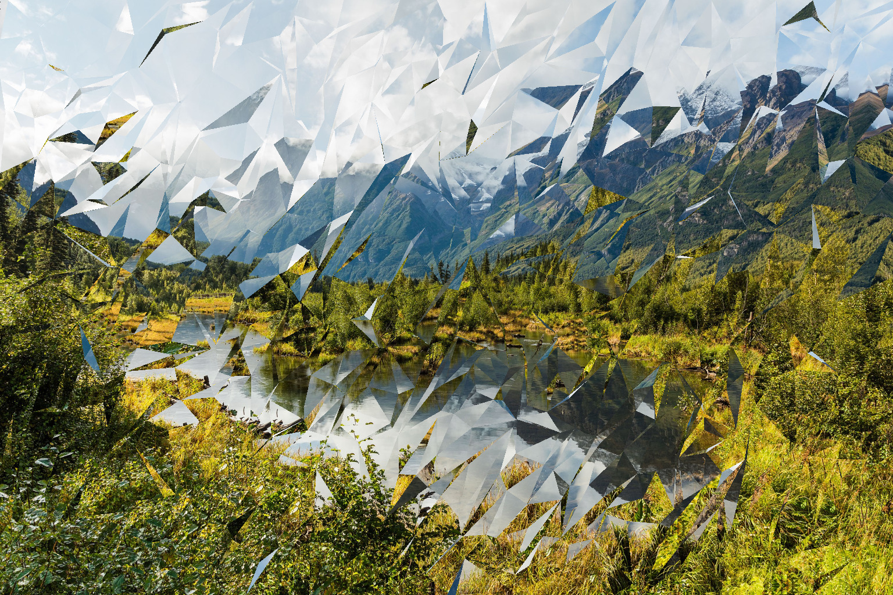
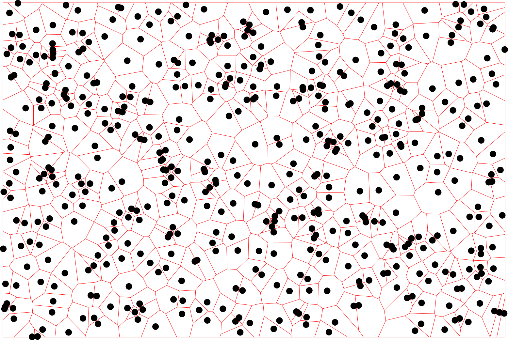

# voronoi-glass

Have you ever looked through a shower door made of intentionally uneven glass? Everything looks distorted, but maybe also beautiful. Now, with this silly program, you can make any picture look this way.

# Example

Here, we apply the program to this base image:

There are a number of parameters which control how the refraction works. For now, we will only vary the `-noise` argument, which determines how uneven the glass is. With `-noise 0.5` (the default), we get this:

With less noise (0.2), we get a smoother version:

If we increase the noise to 1.0, we start to see large changes at almost every polygon:

# How it works

First, we generate a Voronoi diagram because they provide a natural way to break up a plane into polygons. I use a very inefficient O(N^3) algorithm for this, since it was very simple to implement; there exist better algorithms to do this in O(N log(N)) complexity. The resulting diagram looks like so (the mesh is in red, and the black dots are the original points used to generate it):

Next, we convert this diagram into a 3D mesh, randomly perturbing the Z coordinate of each vertex to get an uneven terrain. The amount of random noise is a controllable parameter. I'll note that the change to a given vertex is also controlled by the shape of its surrounding triangles. Generally, sliver triangles will have tips that can safely move a great deal, while the two close points can hardly be moved without greatly changing the normal. The program measures this "sensitivity" and acts accordingly.

Now that we have a rough mesh representing our "glass", we can cast rays onto it. When a ray hits the glass, we apply the refraction formula `sin(theta1) = sin(theta)*n1/n2`. We then take the refracted (bent) ray and carry it forward for a certain fixed Z distance, at which point it "hits" the original image. We also reflect the image in all directions to prevent any scenarios where a ray is refracted off of the image.
